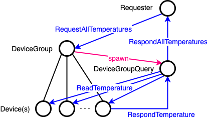
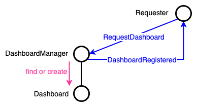
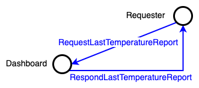

# Akka IoT Tutorial

This project is based on [the tutorial example for getting started with Akka from the official documentation](https://doc.akka.io/docs/akka/current/typed/guide/tutorial.html).

The plan is to reproduce the tutorial example and build on it to obtain a complete application.

[This stage](https://github.com/onewittygrassblade/akka-iot-tutorial/tree/4c312c6378f373e2f909ba9f15d2fffe1df287b4) 
of this repository history reflects the complete code of the tutorial without any addenda.

## Context

This project models part of an IoT system that reports temperature measurements from sensor devices grouped together 
for each user home (see [the official documentation](https://doc.akka.io/docs/akka/current/typed/guide/tutorial.html) for more 
details).


The requirements of the tutorial include the following core logic of this design:
* Register new devices into new or existing groups
* Query a device to record the temperature
* Query a device to return the most recent temperature reading
* Query a device group to return the temperature readings from all devices

Further requirements include:
* Register new dashboard
* Active dashboards should periodically collect temperatures from the corresponding device group
* Query a dashboard to return the latest temperature report

## Actor modelling

Following the [the official documentation](https://doc.akka.io/docs/akka/current/typed/guide/tutorial_2.html), the 
first part of the actor modelling follows the system's representation naturally, with:
* A supervisor actor as the user guardian that represents the whole application
* A single device manager actor, known and available up front, as the entry point for requests to devices and device 
  groups
* Device group actors created on demand by the device manager actor
* Device actors created on demand by a device group actor


The various flows are represented in the following section.

Note for readability:
* In message listings below, some parameters such as `requestId` are omitted.
* In the schemas, message parameters are omitted.

### Device protocol

This is the first main part of the IoT system and is detailed in the tutorial.

#### Device registration

[Reference page](https://doc.akka.io/docs/akka/current/typed/guide/tutorial_4.html)

The device manager handles requests to register a new device to a specified group. If the group does not already 
exist, it is created (*create-on-demand* and *create-watch-terminate* patterns).

Messages:
* Request: `RequestTrackDevice(groupId, deviceId)`
* Response: `DeviceRegistered(deviceActorRef)`

Note: in the happy path, the device always replies with `DeviceRegistered`, whether it already exists or not.


#### Device list request

The device manager handles requests to return a list of registered devices in a specified group. If the group does 
not exist, an empty set is returned.

Messages:
* Request: `RequestDeviceList(groupId)`
* Response: `ReplyDeviceList(ids)`


#### Temperature reading on single device

[Reference page](https://doc.akka.io/docs/akka/current/typed/guide/tutorial_3.html)

Each device can be requested to return its latest temperature measurement. This illustrates the *request-response 
pattern*.

Messages:
* Request: `ReadTemperature`
* Response: `RespondTemperature(deviceId, value)`


#### Request temperature readings from all devices in a device group

[Reference page](https://doc.akka.io/docs/akka/current/typed/guide/tutorial_5.html)

A device group can be requested to return the temperature readings from all its devices.

This case departs from the previous in that it introduces the creation of a query actor to gather the temperature 
readings from all the devices in a group. In addition to keeping the DeviceGroup actor code clean, this allows us to:
* Initialize the query actor with a snapshot of the existing devices, so that devices that have started after the query is fired are ignored.
* Implement a query timeout using the built-in scheduler.

Messages:
* Request: `RequestAllTemperatures(groupId)`
* Response: `RespondAllTemperatures(temperatures)`



The temperatures in `RespondAllTemperatures` will map a device to a `TemperatureReading` which can be one of four states:
* `Temperature`: when the device responded with a temperature value
* `TemperatureNotAvailable`: when the device responded but has no temperature available
* `DeviceNotAvailable`: when the device actor stopped before responding
* `DeviceTimedOut` when the device actor did not respond before the timeout

Note: for completeness, I allowed DeviceManager to handle `RequestAllTemperatures` message as well. The behaviour is 
similar to `RequestDeviceList`: if the group exists, it forwards the request to it; if not, it returns 
`RespondAllTemperatures` with no temperatures readings.

### Dashboard protocol

This second main part of the IoT system is given high level requirements in the [introduction to the example](https://doc.akka.io/docs/akka/current/typed/guide/tutorial.html) of the tutorial.

For clarity, I am assuming the following behaviour:
* A dashboard refers to one and only one device group.
* Multiple dashboards may refer to the same dashboard.
* Each active dashboard periodically collects temperature readings from the device group it refers to.
* A dashboard can be queried to return the latest temperature report.
* The latest temperature report is defined as the latest 5 temperature value collections mapped to the epoch 
  timestamp when they were recorded.

#### Dashboard registration

The dashboard manager handles requests to register a new dashboard. This flow is another example of the 
*create-on-demand* and *create-watch-terminate* patterns.

Messages:
* Request: `RequestDashboard(deviceGroupId, dashboardId)`
* Response: `DashboardRegistered(dashboardActorRef)`



#### Periodic collection of device temperatures

The dashboard actor uses a periodic scheduler to send `RequestAllTemperatures(groupId)` messages to the device 
manager. For this purpose, I chose to pass a reference to the device manager actor to the dashboard manager (which 
passes it to dashboard child actors).

The device temperatures are stored in the dashboard actor in a map
```scala
deviceTemperatures: Map[Long, Map[String, TemperatureReading]]
```
where each map of device id to temperature reading is mapped to a timestamp. For simplicity, this timestamp is taken 
as the current epoch when `deviceTemperatures` is updated.

#### Request latest temperature report

A dashboard can be requested to return the latest temperature report of the devices it monitors. No alterations are 
done to `deviceTemperatures` as it will be up to the recipient to analyse and present the data as desired.

Messages:
* Request: `RequestLastTemperatureReport`
* Response: `RespondLastTemperatureReport(dashboardId, deviceTemperatures)`



## Followup plan

* Refactor in functional style - _Done_
* Add dashboard protocol - _Done_
* Add HTTP server and API
